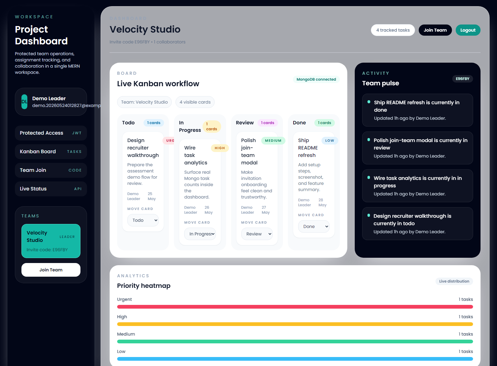

# Project Dashboard



A modular MERN project management dashboard built for team collaboration. The app includes JWT-based authentication, protected frontend routing, live MongoDB task rendering, team join-by-code flow, and a polished Kanban-style dashboard UI.

## Features

- Protected login and registration flow with JWT session storage in `localStorage`
- Route gating so unauthenticated users are redirected to the login screen
- Team invitation onboarding with `Join Team` modal and invite code submission
- MongoDB-backed Kanban board that fetches real tasks from the backend
- Task status updates from the dashboard UI
- Team-aware sidebar, live task counts, and priority analytics

## Tech Stack

- Frontend: React, Vite, Tailwind CSS, Axios, React Hook Form, React Router
- Backend: Node.js, Express, Mongoose, JWT, bcryptjs
- Database: MongoDB Atlas / MongoDB cloud connection

## Project Structure

```text
Dashboard/
|- Backend/
|  |- package.json
|  `- src/
|     |- app.js
|     |- server.js
|     |- config/
|     |- db/
|     |- middleware/
|     |- models/
|     |- modules/
|     |  |- auth/
|     |  |- health/
|     |  |- messages/
|     |  |- tasks/
|     |  |- teams/
|     |  `- users/
|     |- routes/
|     `- utils/
|- Frontend/
|  |- package.json
|  `- src/
|     |- components/
|     |  |- analytics/
|     |  |- audit/
|     |  |- dashboard/
|     |  `- layout/
|     |- pages/
|     |- services/
|     `- utils/
|- docs/
|  `- dashboard-screenshot.png
`- README.md
```

## Environment Setup

Create `Backend/.env` with:

```env
NODE_ENV=development
PORT=5000
CLIENT_URL=http://127.0.0.1:5173
MONGODB_URI=your-mongodb-atlas-connection-string
JWT_SECRET=your-strong-jwt-secret
JWT_EXPIRES_IN=7d
```

Optional frontend override:

```env
VITE_API_URL=http://127.0.0.1:5000/api
```

## Run Locally

1. Install dependencies:

```bash
npm install
```

2. Start the backend and frontend:

```bash
npm run dev
```

3. Open the app:

```text
http://127.0.0.1:5173
```

## Current Backend Endpoints

- `POST /api/auth/register`
- `POST /api/auth/login`
- `POST /api/auth/join-team`
- `GET /api/users/me`
- `GET /api/teams`
- `POST /api/teams`
- `GET /api/teams/:teamId/members`
- `GET /api/tasks`
- `POST /api/tasks`
- `PATCH /api/tasks/:taskId/status`
- `GET /api/messages/:teamId`
- `POST /api/messages/:teamId`

## Assessment-Ready Notes

- The dashboard now renders real task data instead of placeholder cards.
- Login/register and join-team flows are wired to the modular Express + Mongoose backend.
- The frontend is protected by a token gate, so the dashboard is only reachable after authentication.
