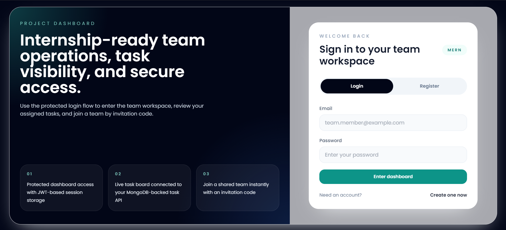
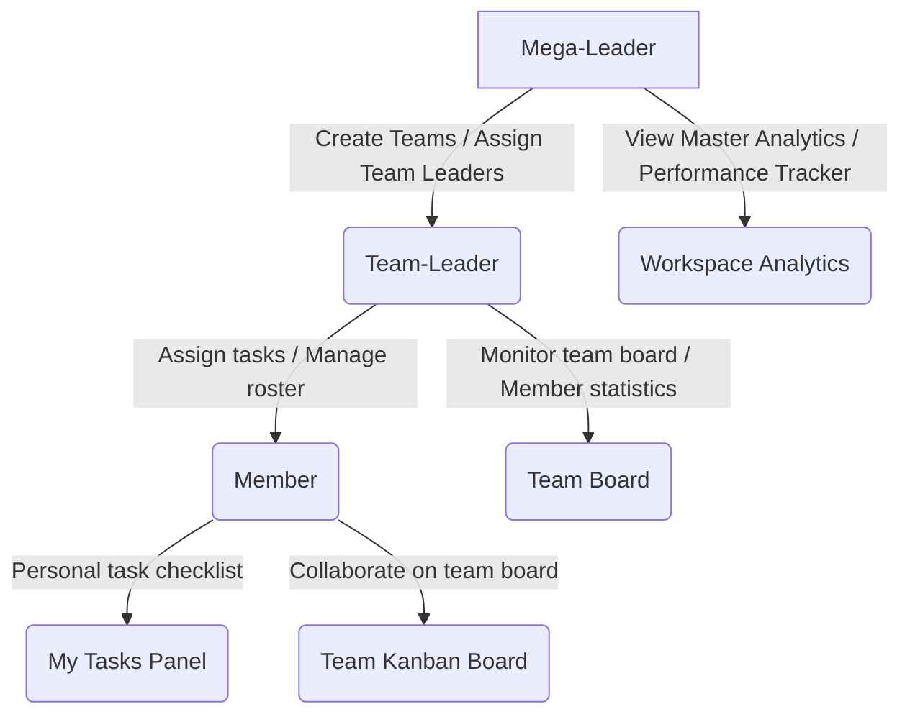
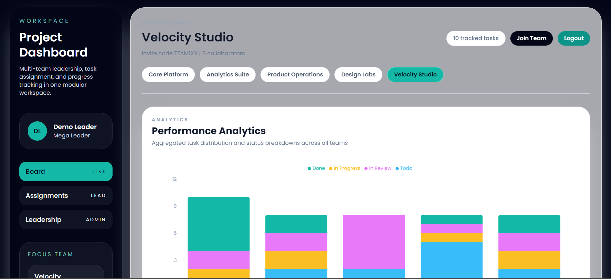
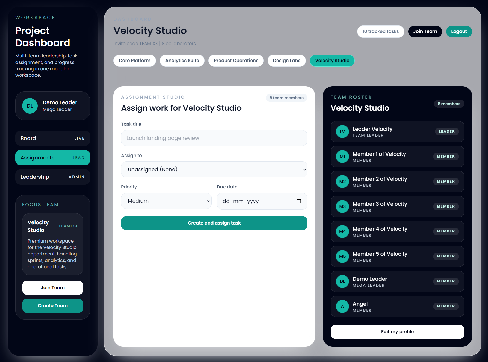
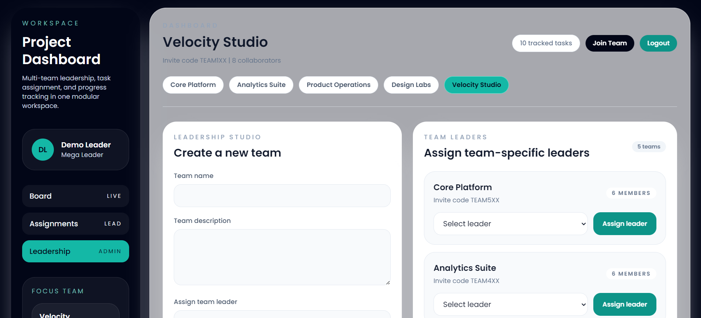
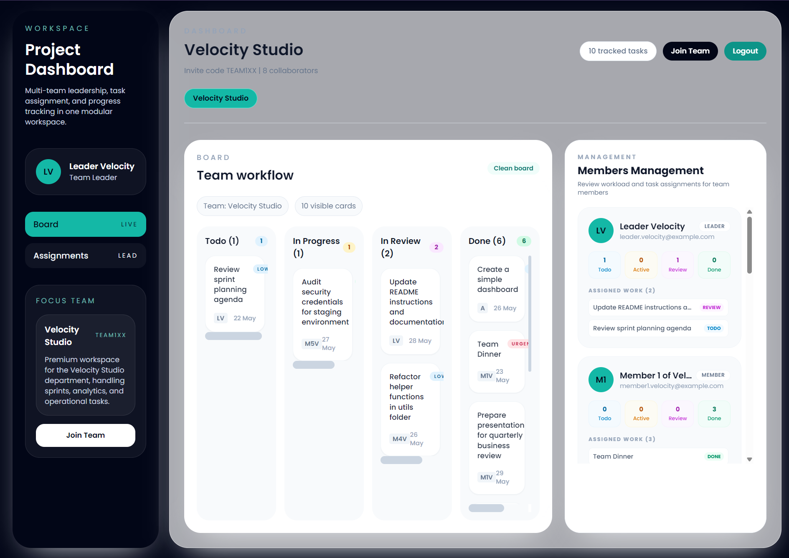
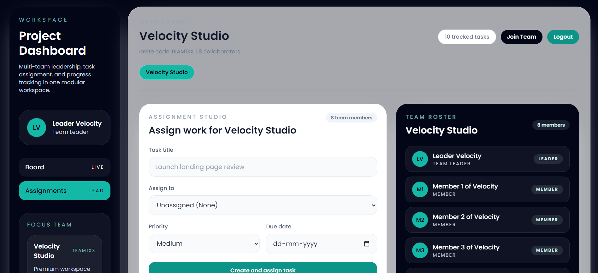
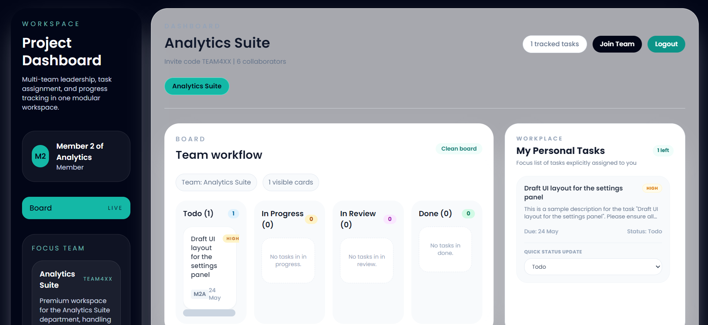

# Multi-Level Team Management System



A premium MERN stack project management and workflow system designed for multi-team environments. The application provides dynamic role-based workspaces for **Mega-Leaders (Platform Admins)**, **Team-Leaders**, and **Members**, complete with interactive progress visualization, task-scoping, and team invitations.

---

## 🏗️ System Architecture & Role Tiering

The workspace implements a structured permission hierarchy mapping to three distinct platform roles, ensuring strict data boundaries and tailored dashboards:



### 1. 👑 Mega-Leader Workspace
- **Zero Board Clutter**: The Kanban board is hidden to allow focused high-level oversight.
- **Performance Analytics**: A dynamic Recharts stacked bar chart aggregating status distributions (Todo, In Progress, In Review, Done) across all teams.
- **Detailed Member Workloads**: A line graph mapping active vs. completed tasks for each member in the selected focus team.
- **Team Grid**: Cards displaying the team name, description, collaborator count, team leader name, and a visual progress bar.
- **Leadership Center**: Create teams, generate invite codes, and nominate/assign team leaders.




### 2. ⚡ Team-Leader Workspace
- ** Roster Management Panel**: Visual tracking of team collaborators with task distribution summaries per member (Todo, Active, Review, Done).
- **Team-scoped Kanban**: A simplified view of the team's Kanban board utilizing ScrollableStacks to keep card columns clean and bounded.
- **Work Assignment Studio**: Dropdown task creation linking title, priority, due date, and assignees directly from the team's roster.



### 3. 👥 Member Workspace
- **My Tasks Panel**: A personal focus checklist listing tasks assigned explicitly to the logged-in user, complete with inline status dropdowns for instant updates.
- **Team Board**: A read-only view of the team's active sprint board showing how work aligns across the team.



---

## 🛠️ Technology Stack

- **Frontend**: React (Vite), Tailwind CSS, Recharts (Data Visualizations), Axios, React Hook Form, React Router
- **Backend**: Node.js, Express, MongoDB Atlas, Mongoose, JWT (Authentication), bcryptjs (Hashing)
- **Tooling**: npm workspaces (monorepo structure)

---

## 📁 Project Directory Structure

```text
Dashboard/
├── Backend/
│   ├── package.json
│   ├── seed.js                   # Mock database seeding script
│   └── src/
│       ├── app.js                # Express app configuration
│       ├── server.js             # Server listener entry point
│       ├── db/                   # Database connection helper
│       ├── models/               # Mongoose schemas (User, Team, Task, TeamMember)
│       ├── modules/              # Modular backend features (auth, tasks, teams)
│       └── utils/                # Helper functions (accessControl, serialization)
└── Frontend/
    ├── package.json
    └── src/
        ├── components/
        │   ├── analytics/        # Recharts Performance & Single Team components
        │   ├── dashboard/        # Panels, Grids, and Card components
        │   └── layout/           # AppShell, TopBar, and Sidebar navigation
        ├── pages/                # Main pages (DashboardPage, LoginPage)
        ├── services/             # Axios API services
        └── utils/                # Navigation configs and auth utilities
```

---

## 🚀 Getting Started

### 1. Environment Configuration

Create a `.env` file in the `Backend` directory containing:

```env
NODE_ENV=development
PORT=5000
CLIENT_URL=http://127.0.0.1:5173
MONGODB_URI=your-mongodb-atlas-connection-string
JWT_SECRET=your-strong-jwt-secret
JWT_EXPIRES_IN=7d
```

### 2. Dependency Installation

From the root directory, install all monorepo dependencies:

```bash
npm install
```

### 3. Populating Mock Data

We provide a seeding script to easily set up testing accounts, teams, and sample tasks. Run the following command from the `Backend` folder:

```bash
cd Backend
node seed.js
```

> [!NOTE]
> The seed script will output a table of generated logins, including the upgraded **Mega-Leader** email, five team leader accounts, and multiple team member accounts (all using the password `password123`).

### 4. Running the Development Servers

Start the backend node server and frontend Vite bundler concurrently from the root directory:

```bash
npm run dev
```

The application will be accessible at [http://127.0.0.1:5173](http://127.0.0.1:5173).

---

## 📡 API Routing Reference

### Authentication & Users
- `POST /api/auth/register` - Create an account
- `POST /api/auth/login` - Sign in and receive JWT token
- `POST /api/auth/join-team` - Join a team by invite code
- `GET /api/users/me` - Retrieve current session payload

### Team Management
- `GET /api/teams` - Fetch teams for current user
- `POST /api/teams` - Create a new team (Mega-Leader only)
- `GET /api/teams/analytics` - Fetch status summaries for all teams (Mega-Leader only)
- `GET /api/teams/:teamId/members` - Retrieve collaborator roster
- `PATCH /api/teams/:teamId/leader` - Nominate team leader (Mega-Leader only)

### Task Management
- `GET /api/tasks?teamId=<id>` - Retrieve scoped team tasks
- `POST /api/tasks` - Create a task
- `PATCH /api/tasks/:taskId/status` - Update task status

---

## 💎 Design System & UX Refinements

- **ScrollableStack pattern**: Column containers enforce `max-height` and `overflow-y-auto` rules with custom webkit scrollbars for a clean Figma-like aesthetic.
- **Card Counters**: Dynamic count badges on column headers provide instant visibility (e.g. `Todo (4)`).
- **Glassmorphic components**: Premium blurred white panels, soft background gradients, and smooth state micro-animations enhance workspace interactions.
